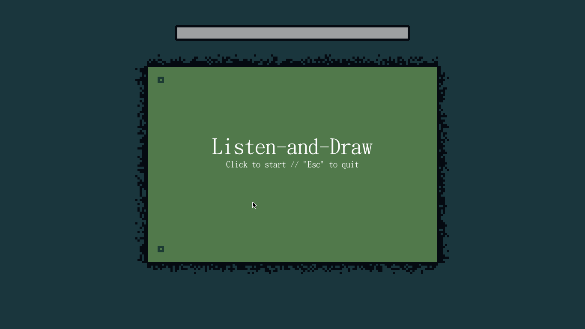

# listen-and-draw

An interactive widget where a user is invited to draw how they feel on a scrolling canvas as they listen to an experimental sound art track playing in the background.

Features video replay functionality.

This is a collaborative project and is still under development - I am designing the program, and my collab partner is working on the accompanying sound art piece. Said sound art piece is not yet finished, so currently a placeholder music track is being used instead. If you want to play the in-development version for yourself, you need to place a MP3 file called "test.mp3" inside the empty "\audio" folder.

CURRENT WORKING PROTOTYPE:
--------------
Features sound playback and live replay!
https://streamable.com/nt7f4

Sample GIF:

